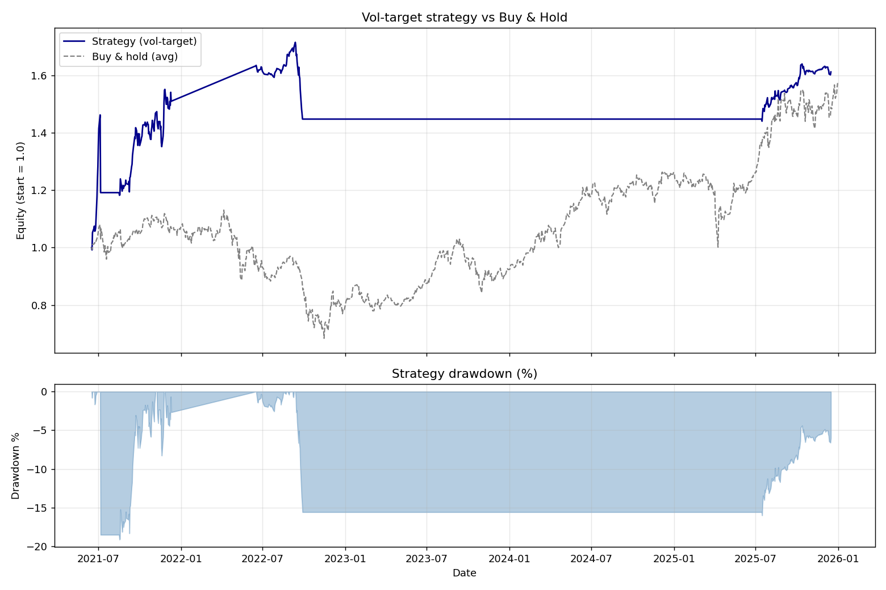

# Volatility-Regime Momentum Strategy

Research-grade quant project: a short-horizon directional model on VN30 with
triple-barrier labels, walk-forward validation, three model tiers
(LR → XGBoost → GRU), a from-scratch backtest engine with realistic costs,
and volatility-targeted position sizing.

Built as evidence of process for an AI Quantitative Research internship.

---

## Headline Result

| Metric            | Strategy     | Buy & hold    |
|-------------------|--------------|---------------|
| CAGR              | **+21.5%**   | +13.7%        |
| Annual vol        | 20.7%        | 31.0%         |
| **Sharpe**        | **0.86**     | 0.43          |
| Max drawdown      | **-19.1%**   | **-55.3%**    |
| Calmar            | 1.12         | 0.25          |



The full reasoning, including hypothesis, methodology, results, **sub-period
breakdown, statistical significance (Lo t-stat, bootstrap CI, Deflated Sharpe)**,
and limitations, lives in **[RESEARCH_NOTE.md](RESEARCH_NOTE.md)** — that
document is the "research note" deliverable, not this README.

### Read this before quoting the 0.86 Sharpe

The 0.86 is a **point estimate on n = 618 days of OOS predictions**. It is
**not statistically significant** at the 5% level:

- Lo (2002) t-stat = **1.22, p = 0.22**
- Block-bootstrap 95% CI = **[-0.37, +1.59]** (contains zero)
- Deflated Sharpe (n = 4 trials): **p = 0.43**
- Deflated Sharpe (n = 60 trials): **p = 0.87**

Sub-period breakdown also reveals concentration:

| Year  | Return | Sharpe  |
|-------|--------|---------|
| 2021  | +50.9% | +2.10   |
| 2022  | -11.3% | -2.51   |
| 2023  |  +0.0% |  0.00   |  ← drawdown breaker stayed on for the year
| 2024  |  +0.0% |  0.00   |  ← same
| 2025  | +11.4% | +2.02   |

So the headline number is positive but **the SR depends on 2021 and 2025**.
Two of five walk-forward folds were flat. We report this rather than hide it.
See **RESEARCH_NOTE.md §4-§5** for the full treatment.

---

## Project Layout

```
quant-momentum-regime/
├── README.md                  <- you are here
├── RESEARCH_NOTE.md           <- hypothesis → results → limitations
├── requirements.txt
├── configs/strategy.yaml      <- all knobs (universe, costs, vol target, etc.)
│
├── data/
│   ├── raw/                   <- OHLCV parquets from vnstock
│   ├── processed/             <- per-ticker feature frames
│   └── predictions/           <- walk-forward model predictions
│
├── src/
│   ├── ingestion.py           <- vnstock -> parquet
│   ├── features.py            <- RSI/MACD/BB/ATR/vol/regime + shift(1)
│   ├── labeling.py            <- triple barrier
│   ├── splits.py              <- walk-forward folds
│   ├── models/
│   │   ├── baseline_lr.py
│   │   ├── xgb_model.py       <- multiclass + binary, both Optuna-tunable
│   │   └── lstm_model.py      <- 2-layer GRU in PyTorch
│   ├── backtest/
│   │   ├── engine.py          <- signal -> position -> equity
│   │   ├── risk.py            <- vol-target + drawdown breaker
│   │   └── metrics.py         <- Sharpe / Sortino / Calmar / rolling Sharpe
│   ├── train.py               <- walk-forward CV for all 3 models
│   ├── train_all.py           <- run train.py across the universe
│   ├── plot_regime.py         <- regime sanity-check plots
│   ├── backtest/run.py        <- portfolio backtest driver
│   └── report.py              <- tearsheet + plots
│
├── notebooks/                 <- EDA scratchpads (kept empty / out of scope)
├── reports/
│   ├── portfolio_metrics.json
│   ├── buy_hold_metrics.json
│   ├── portfolio_equity_curve.csv
│   └── figures/
└── mlruns/                    <- MLflow tracking (gitignored)
```

## How to Run

**0. Install (Python 3.10 recommended; `pandas-ta` requires 3.12+ but we use `ta`):**

```bash
pip install -r requirements.txt
```

**1. Pull the data:**

```bash
python -m src.ingestion --universe          # all 10 VN30 names, ~6 years
# or single ticker:
python -m src.ingestion --ticker FPT
```

**2. Build features + regime labels:**

```bash
python -m src.features
```

**3. Train all 3 models per ticker (walk-forward, ~8 minutes on CPU):**

```bash
python -m src.train_all
```

**4. Portfolio backtest:**

```bash
python -m src.backtest.run
```

**5. Plots and tearsheet:**

```bash
python -m src.report
```

**6. (NEW) Sub-period breakdown + statistical significance of the Sharpe:**

```bash
python -m src.robustness
```

Produces:

- `reports/robustness_subperiods.json` — Sharpe / return / DD by calendar year,
  walk-forward fold, and vol regime
- `reports/robustness_significance.json` — Lo t-stat, block-bootstrap 95% CI,
  Deflated Sharpe Ratio
- `reports/figures/subperiod_sharpe.png`
- `reports/figures/rolling_sharpe_with_ci.png`

Key finding: the headline SR of 0.86 is **not statistically significant**
on n = 618 days (Lo p = 0.22, bootstrap CI contains 0, DSR p = 0.43).

## Configuration

Everything tuneable lives in `configs/strategy.yaml` — there are **no magic
numbers in the source code**. To change the universe, swap tickers there. To
make the strategy more aggressive, raise `target_annual_vol` and
`max_position_size`. To make it more conservative, lower them and tighten
`max_drawdown_threshold`.

## Engineering Hygiene (the things reviewers actually check)

- **No lookahead.** Every rolling feature is computed on past data and then
  `shift(1)`'d so that row at time *t* only sees info up to close of *t-1*.
  See `features._shift_features`.
- **No random splits.** `splits.walk_forward_splits` returns strictly
  chronological folds with an embargo gap. (Pitfall called out explicitly in
  the plan.)
- **No leak in feature_columns.** `features.feature_columns` excludes
  `label`, `label_ret`, `label_hdays` so the model never sees the answer.
- **Hyperparameters tuned inside the first training fold only**, then
  reused. Optuna does not see any test data.
- **Backtest pays real costs.** Brokerage (15 bps), sell tax (10 bps), and
  slippage (5 bps) are applied on every position change. Cost is scaled by
  current equity (not absolute), so the curve compounds correctly.
- **Drawdown circuit breaker.** When portfolio DD > 15%, exposure is cut to
  0 for 10 trading days.
- **MLflow tracking** (optional). Run without `--no-mlflow` to log params +
  per-fold metrics under `mlruns/`.

## Method One-Liners (interview prep)

| Question                                | One-line answer                                                                                              |
|-----------------------------------------|--------------------------------------------------------------------------------------------------------------|
| Why triple-barrier?                     | Fixed-horizon return labels have overlapping horizons and tons of label noise; triple barrier cleanly separates "up vs down vs flat" with a known holding period. |
| Why ATR-scaled barriers?                | A 2% barrier is huge in a calm regime and trivial in a volatile one. ATR scales the threshold to local vol so the label difficulty is roughly constant across regimes. |
| Cost?                                   | 15 bps brokerage / side, 10 bps sell tax, 5 bps slippage. ~30 bps round trip on a typical turnover day.     |
| Why DL didn't win?                      | Daily data is small (~1 800 rows × 10 names). Deep models shine with much more data. The GRU was comparable to XGBoost on logloss but lost on accuracy — classic over-fit / small-data regime. |
| Why vol-target?                         | A 10% vol target shrinks positions in 2022 and 2024-25 (high-vol periods) and lets them breathe in 2021 (low-vol). This is the single biggest reason the strategy drawdown (-19%) is a third of buy-hold's (-55%). |
| Is 0.86 Sharpe significant?              | **No** at conventional levels: Lo t = 1.22 (p = 0.22), block-bootstrap 95% CI = [-0.37, +1.59] contains 0, Deflated Sharpe p = 0.43. The point estimate is suggestive, not conclusive. Need n ≈ 1000 days at the same SR for p < 0.05. |
| What's the failure mode?                 | The drawdown breaker locks exposure after a 15% DD and only resets after 10 trading days. In 2023-24 it stayed on for two consecutive years — those two years contributed 0% to the headline number. Production code needs a vol-relative breaker threshold. |
| What would break this in production?    | (a) Regime change (e.g. policy shift that breaks the vol-return link). (b) Liquidity drought in the universe. (c) Cost regime change (e.g. tax change). (d) Statistically, the result may simply not replicate on a longer window — we honestly don't know yet. |

See **[RESEARCH_NOTE.md](RESEARCH_NOTE.md)** for the long-form version.