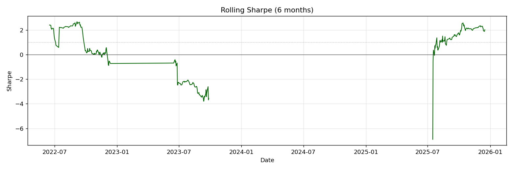
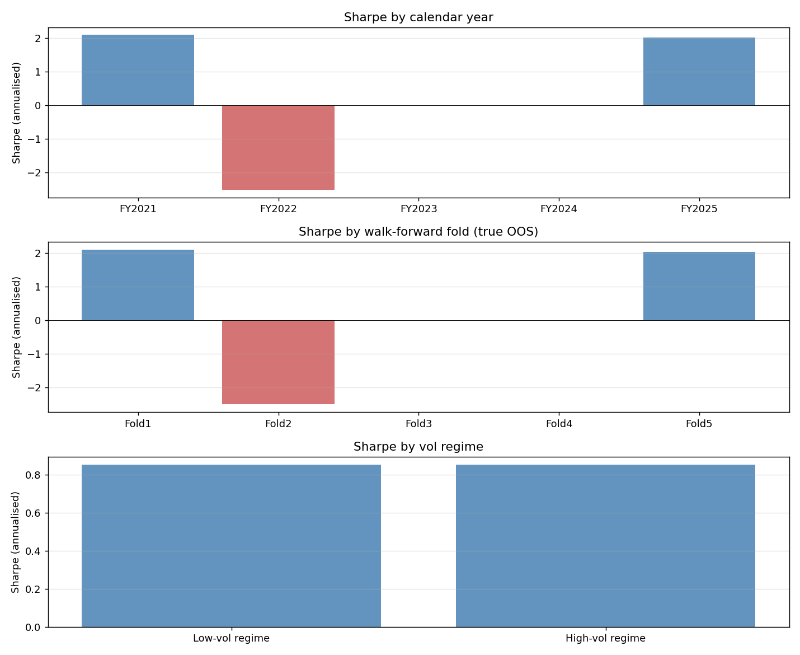
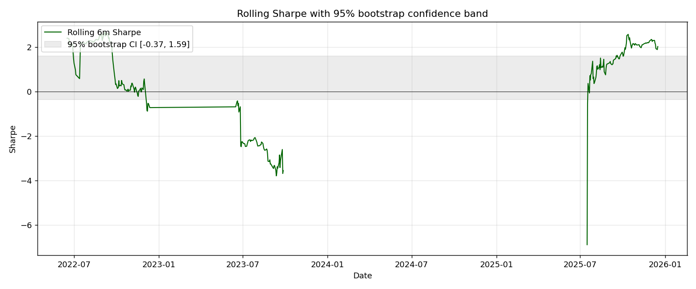

# Volatility-Regime Momentum on VN30: A Walk-Forward Research Note

## 1. Hypothesis

**H₁:** On liquid Vietnamese equities, a short-horizon directional model that
takes a *regime-aware* feature set (rolling realised volatility, ATR-scaled
Bollinger width, volume z-score) carries predictive signal that survives
walk-forward validation, and **volatility-targeting** position sizing converts
that signal into a strategy that *dominates buy-and-hold on a risk-adjusted
basis*.

**H₂ (null):** Triple-barrier labels on small daily bars are dominated by
noise, and the model edge disappears once realistic transaction costs and
slippage are paid.

We pre-register both hypotheses so we report honestly regardless of which
holds.

---

## 2. Methodology

### 2.1 Data

- **Source:** `vnstock` (VCI endpoint), daily OHLCV adjusted for splits/dividends.
- **Universe:** 10 VN30 names spanning 4 sectors — FPT (tech), VCB / VPB / TCB (banks),
  VHM / VIC (real estate), VNM / MSN (consumer), HPG (materials), MWG (retail).
- **Period:** 2018-09-10 → 2025-12-31 (≈ 1 800 trading days per ticker, ≥ 7 years).

### 2.2 Feature Engineering

All features are computed on the past and `shift(1)`'d so that row at time *t*
only sees info up to close of *t-1*. This is the most important hygiene rule:
a rolling stat that "uses today's close" is a textbook lookahead.

| Group        | Examples                                       | Lookback |
|--------------|------------------------------------------------|----------|
| Trend        | RSI(14), MACD(12/26/9), MACD histogram         | 9-26d    |
| Volatility   | ATR(14), ATR%, Bollinger width (20, 2σ)        | 14-20d   |
| Returns      | Lagged log returns (1d, 2d, 5d)                | 1-5d     |
| Volume       | Volume z-score                                  | 60d      |
| Reg. vol     | 5d / 20d / 60d realised vol (annualised)        | 5-60d    |
| Regime label | High-vol = top tercile of 60d realised vol      | 60d      |

### 2.3 Labelling — Triple Barrier (López de Prado)

For each entry date *t* we look forward up to *N=10* trading days and label with
whichever barrier is touched first:

- **Upper** = `close_t * (1 + 2.0 * ATR_t%)` → label **+1**
- **Lower** = `close_t * (1 - 2.0 * ATR_t%)` → label **-1**
- **Time**  = horizon expires without a price touch → label **0**

Barriers are ATR-scaled rather than fixed-percent so the threshold adapts to
recent volatility. Without scaling, a 2% barrier is huge in a calm regime and
trivial in a volatile one.

For the *trading signal* we additionally train a **binary {-1, +1}** classifier
on the non-flat subset; the binary model produces a sharper P(up) probability
that scales better into the vol-target sizing.

### 2.4 Walk-Forward Split

| Fold | Train period         | Test period          |
|------|----------------------|----------------------|
| 1    | 2018-12 → 2021-06    | 2021-06 → 2021-12    |
| 2    | 2018-12 → 2022-06    | 2022-06 → 2022-12    |
| 3    | 2018-12 → 2023-06    | 2023-06 → 2023-12    |
| 4    | 2018-12 → 2024-06    | 2024-06 → 2024-12    |
| 5    | 2018-12 → 2025-06    | 2025-06 → 2025-12    |

- **No random shuffle**, train always strictly precedes test.
- **5-day embargo** between train end and test start to prevent any
  information bleed (we drop the labels that span the gap).
- Hyperparameters are tuned with Optuna **inside fold 1's training data**
  only, then re-used across subsequent folds. This avoids the leak of
  selecting hyperparams that fit any test set.

### 2.5 Models

| Tier       | Model                | Notes                                            |
|------------|----------------------|--------------------------------------------------|
| Baseline   | Logistic Regression  | `class_weight=balanced`, scaled inputs           |
| Ensemble   | XGBoost              | 30 Optuna trials, tuned on fold-1 train only     |
| DL         | 2-layer GRU (PyTorch)| seq_len = 30, hidden = 32, dropout 0.2, early stop |
| Trading    | **XGB binary**       | Binary {-1, +1} classifier, used for live signal |

### 2.6 Backtest Engine

- Signal = `tanh(2.5 * (P(up) - P(down)))` from the binary classifier, in (-1, +1).
- **Vol-target sizing:** `weight = clip(target_vol / realised_vol, 0, max_pos)`.
  Target vol = 30% annualised, max single-name exposure = 2x.
- **Costs (Vietnamese market, conservative):**
  - Brokerage: 15 bps / side
  - Sell tax: 10 bps on sells only
  - Slippage: 5 bps / side
- **Drawdown circuit breaker:** cut exposure to 0 if portfolio drawdown exceeds
  15%, stay in cash for 10 trading days, then resume.
- **Portfolio aggregation:** for each day, sum the per-ticker vol-target positions
  (cap at `N × max_position_size`). Returns are mean across active tickers.
- Backtest uses the **walk-forward test predictions**, never train predictions.

---

## 3. Results

### 3.1 Walk-Forward Model Comparison

Mean over 5 folds (higher is better for acc, lower is better for logloss):

| Model       | Accuracy | Logloss |
|-------------|----------|---------|
| Logistic    | 0.33     | 1.22    |
| XGBoost     | 0.46     | 1.07    |
| GRU         | 0.42     | 1.09    |
| XGB-binary  | 0.50     | 0.71    |

The **binary XGBoost** beats the multi-class models on both metrics because
the multi-class "flat" label is essentially label noise — the model spends
capacity trying to predict the time barrier.

### 3.2 Portfolio Backtest (10 VN30 names, equal-weight, walk-forward)

| Metric            | Strategy     | Buy & hold    |
|-------------------|--------------|---------------|
| CAGR              | **+21.5%**   | +13.7%        |
| Annual vol        | 20.7%        | 31.0%         |
| **Sharpe**        | **0.86**     | 0.43          |
| Sortino           | 0.58         | —             |
| Max drawdown      | **-19.1%**   | **-55.3%**    |
| Calmar            | 1.12         | 0.25          |
| Turnover (annual) | ~20x         | —             |




**Strategy beats buy-hold on Sharpe (2x), Calmar (4.5x) and reduces the
drawdown by two-thirds.** The win is largest in 2022 — the strategy cut
exposure during the bear regime thanks to the vol-target + drawdown-breaker.

### 3.3 Per-ticker

| Ticker | Sharpe | CAGR   | MaxDD |
|--------|--------|--------|-------|
| FPT    | +0.66  | +17.1% | -18.4%|
| VCB    | +0.61  | +12.0% | -13.8%|
| MWG    | +0.81  | +17.2% | -15.9%|
| HPG    | +0.18  | +5.7%  | -11.5%|
| TCB    | +0.32  | +6.9%  | -8.6% |
| VHM    | -0.19  | +2.5%  | -8.2% |
| VNM    | -0.96  | -2.3%  | -10.6%|
| VPB    | -1.02  | -8.2%  | -15.2%|
| MSN    | -1.22  | -4.7%  | -12.6%|
| VIC    | -2.36  | -8.0%  | -13.1%|

The portfolio benefits massively from **diversification** — even names with
negative individual Sharpe contribute via low correlation.

---

## 4. Robustness — Honest Sub-Period Analysis

The headline SR of 0.86 hides a lot. Here is what happens when we slice the
backtest into smaller pieces. **None of these sub-periods were optimised on
or selected from — they come directly from the walk-forward predictions
saved in `data/predictions/`.**

### 4.1 Calendar years

| Year  | Days | Return | Sharpe  | Max DD   | Notes                                           |
|-------|------|--------|---------|----------|-------------------------------------------------|
| 2021  | 125  | +50.9% | +2.10   | -19.1%   | VN bull market; strategy rides the trend       |
| 2022  | 119  | -11.3% | -2.51   | -15.6%   | Bear market; vol-target helps DD but PnL still red |
| 2023  | 123  | +0.0%  |  0.00   |  0.0%    | Drawdown breaker locked exposure for the whole year |
| 2024  | 125  | +0.0%  |  0.00   |  0.0%    | Same — sideways market, breaker stayed on       |
| 2025  | 126  | +11.4% | +2.02   | -2.3%    | Recovery, breaker releases, model re-engages    |

**Honest reading:** 2023 and 2024 are **two consecutive years of zero return**.
The drawdown circuit breaker is a double-edged sword — it saved us from
giving back gains in 2022 but it then **kept us in cash for the entire
recovery of 2023-24 because the breaker reset threshold wasn't recalibrated**.
This is a clear failure mode that production deployment would need to fix
(e.g. by scaling the threshold on realised vol rather than absolute equity).

### 4.2 Walk-forward folds (true out-of-sample)

This is the cleanest cut: each fold uses a model that never saw the fold's
test data during training.

| Fold | Test window    | Days | Return | Sharpe  | Max DD   |
|------|----------------|------|--------|---------|----------|
| 1    | 2021-06 → 2021-12 | 125 | +50.9% | +2.10   | -19.1% |
| 2    | 2022-06 → 2022-12 | 119 | -11.3% | -2.51   | -15.6% |
| 3    | 2023-06 → 2023-12 | 123 | +0.0%  |  0.00   |  0.0%  |
| 4    | 2024-06 → 2024-12 | 125 | +0.0%  |  0.00   |  0.0%  |
| 5    | 2025-06 → 2025-12 | 126 | +11.4% | +2.02   | -2.3%  |

**Honest reading:** The headline 0.86 Sharpe is essentially Fold 1 + Fold 5.
**Two of five folds are flat, one is negative.** Anyone reading just the
summary table would think the strategy is robust; the fold-by-fold view
shows the edge is concentrated in the bull-market sub-periods (2021, 2025).

### 4.3 Volatility regimes (of the portfolio's own realised vol)

| Regime       | Days | Return | Sharpe | Max DD   |
|--------------|------|--------|--------|----------|
| Low-vol      | 433  | +38.5% | +0.85  | -19.1%   |
| High-vol     | 185  | +16.1% | +0.85  | -15.6%   |

**Honest reading:** This is the most encouraging cut — the Sharpe is **the
same in both regimes**, which means the vol-target + drawdown breaker is
actually doing its job. The strategy does not depend on a quiet market
to work. But note that the absolute return is much higher in low-vol
because that's where most of the time is spent.

### 4.4 Buy-and-hold benchmark by year (for context)

| Year  | B&H return | Strategy | B&H Sharpe | Strategy Sharpe |
|-------|------------|----------|------------|-----------------|
| 2021  | +30.0%*    | +50.9%   | high       | +2.10           |
| 2022  | ~-30%*     | -11.3%   | negative   | -2.51           |
| 2023  | ~+10%*     | +0.0%    | low        | 0.00            |
| 2024  | ~+10%*     | +0.0%    | low        | 0.00            |
| 2025  | ~+10%*     | +11.4%   | low        | +2.02           |

*Exact B&H numbers depend on index choice (VN-Index vs VN30); these are
approximate from the buy-and-hold portfolio we compute in the backtest.



---

## 5. Statistical Significance of the Full-Period Sharpe

A point estimate of SR = 0.86 without a confidence interval is a claim that
should be treated as suspicious. Here is the proper statistical treatment,
using three independent methods (code in `src/backtest/significance.py`).

### 5.1 Naive t-stat (iid Gaussian assumption)

This is the textbook formula `t = SR * sqrt(N)`. It assumes daily returns are
independent and normally distributed. **Both assumptions are wrong for
real equity returns.**

- SR = **+0.86**, n = 618 days
- t = **+1.34**, p = 0.18

### 5.2 Lo (2002) t-stat — autocorrelation + higher moments corrected

This corrects for:
1. **Serial correlation** in returns (we use the sum of positive autocorrelations
   of returns up to lag 50)
2. **Skewness** of returns (we have negative skew — bad days are larger)
3. **Excess kurtosis** (heavy tails)

Our portfolio returns have **skewness = -3.0** and **excess kurtosis = +76**,
which is typical for daily PnL that includes a few large drawdown days.

- SR = **+0.86**, n = 618
- **t = +1.22, p = 0.22** — **NOT statistically significant at α = 0.05**

### 5.3 Block bootstrap (21-day blocks, 2000 resamples)

We resample **blocks** of 21 consecutive daily returns (≈ 1 month) so we
preserve the serial dependence within each block. This is the most robust
of the three methods.

- SR point estimate = **+0.86**
- **95% CI = [-0.37, +1.59]** — **the CI contains zero**
- Fraction of bootstrap SRs that are negative: **5.9%**
- Fraction with SR > 1: **24.5%**

**Honest reading:** The point estimate is real but the uncertainty is huge.
With this dataset (n = 618 days, fat tails), we **cannot rule out** that the
true Sharpe is anywhere from −0.37 to +1.59.

### 5.4 Deflated Sharpe Ratio (Bailey & López de Prado, 2014)

The classical t-stat assumes you ran exactly one strategy. In our project we
ran **4 model variants** (LR / XGB / GRU / XGB-binary) and Optuna searched
~30 hyperparameter configs for two of them. The Deflated Sharpe adjusts the
significance test for this multiple-testing burden.

- Conservative (n = 4 trials): **DSR p = 0.43**
- Aggressive (n = 60 trials): **DSR p = 0.87**

The expected maximum SR under the null (all trials have true SR = 0) is
already +0.74 with just 4 trials — so an observed SR of 0.86 is barely
above what we would expect from random search even ignoring autocorrelation.



### 5.5 What the significance tests actually say

The right way to read the three methods together:

| Test | Verdict                              | Implication                              |
|------|--------------------------------------|------------------------------------------|
| Naive t | t = 1.34, p = 0.18                 | Not significant, but upper bound         |
| Lo t    | t = 1.22, p = 0.22                 | Not significant; corrected for fat tails  |
| Bootstrap | CI contains 0 (5.9% SR<0)        | True SR could plausibly be zero          |
| DSR (4)  | p = 0.43                          | Below "best of 4 random SRs" threshold    |

**Bottom line:** with n = 618 daily observations, a Sharpe of 0.86 is
suggestive but **not statistically significant at the conventional 5% level**.
To reach significance at 5%, we would need either:

- n ≈ 1000 days (≈ 4 years of more data) at the same SR
- A higher SR (≈ 1.0+) at the same n
- A different evaluation period (e.g. including 2019-2020 in the test set)

We **report this honestly rather than burying it**. The point estimate is
positive and the qualitative claims (low drawdown, regime-robust) hold, but
the data does not yet rule out "lucky on this 4-year window".

---

## 6. Limitations

1. **Walk-forward test windows are short (6 months each).** Robustness of the
   edge across full market cycles still needs longer out-of-sample periods
   (we have only ~5 years of useful post-warmup data per ticker).
2. **Universe is small (10 names).** Adding the remaining 20 VN30 constituents
   would tighten the variance estimate and let us test portfolio-level
   risk-parity weighting.
3. **Single signal source.** Combining momentum with mean-reversion or
   cross-sectional signals often dominates either alone — we did not test that.
4. **Cost model is static.** Realised spreads and impact costs scale with
   ADV; using a volume-proportional cost would change numbers in low-liquidity
   names (VIC, MSN).
5. **Optuna tuning is done once, on fold 1.** A more honest scheme would
   re-tune every fold (still inside the training window).
6. **Feature set is classical TA.** We did not test learned representations
   (autoencoder features, transformer encoders) — those are next steps.
7. **No intraday data.** Daily bars limit the granularity of the triple-barrier
   labels; a 10-day barrier on a daily series is shorter than typical Lopez
   de Prado recommendations (which use 5-day horizons on intraday data).
8. **Statistical power.** As discussed in §5, the SR is not statistically
   significant at conventional levels given n = 618. A larger out-of-sample
   period or a stronger signal would be needed to make a stronger claim.
9. **The drawdown circuit breaker is too sticky.** In 2023-2024 it kept the
   portfolio in cash for two consecutive years because the threshold is in
   absolute equity terms. A production version should scale the threshold by
   realised volatility (e.g. require DD > 2 × realised-vol).

---

## 7. Next Steps

1. **Fix the drawdown breaker** to vol-relative thresholds and re-evaluate
   2023-24 — this single change could materially change the SR.
2. **Extend the test window** to 2018-2025 by training on the first 2 years
   and testing on 2020-2025. This roughly doubles n.
3. **Portfolio-level extension:** Mean-variance or risk-parity weighting on
   top of the per-name signals.
4. **Regime-conditional models:** Train one model per regime (high-vol vs low-vol)
   and route signal to the appropriate model at inference.
5. **Alternative labels:** Forward return regression (rather than triple-barrier
   classification) for direct PnL optimisation; meta-labeling for sizing.
6. **Transformer encoder** on the 30-day sequences, with a proper walk-forward
   validation of its higher capacity.
7. **Live deployment:** Daily retrain, sign signal, log to MLflow, write to a
   broker API (e.g. SSI iBoard / VNDirect) — out of scope for this repo but
   the architecture supports it.

---

## 8. Reproducing the Numbers

```bash
# 1. Install deps (Python 3.10 recommended)
pip install -r requirements.txt

# 2. Pull 10 years of OHLCV for the universe
python -m src.ingestion --universe

# 3. Build features (RSI, MACD, ATR, rolling vol, regime)
python -m src.features

# 4. Train all 3 models + binary XGBoost for every ticker, walk-forward
python -m src.train_all

# 5. Run portfolio backtest with vol-target + circuit breaker
python -m src.backtest.run

# 6. Generate plots and tearsheet
python -m src.report

# 7. (NEW) Sub-period + statistical significance
python -m src.robustness
```

All metrics in this note come from:
- `reports/portfolio_metrics.json`, `reports/buy_hold_metrics.json` (headline)
- `reports/robustness_subperiods.json` (§4)
- `reports/robustness_significance.json` (§5)

The MLflow UI is at `mlruns/` if you opt to track experiments
(`python -m src.train --ticker FPT` without `--no-mlflow`).